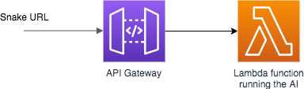

## Deploy a pretrained snake AI into your AWS account

This section will deploy a pre-trained AI on a Lambda function. An API Gateway will be created in front of it to provide a snake API entrypoint (see [BattleSnake API](https://docs.battlesnake.com/snake-api)):

> __Estimated cost__ : this architecture is entirely Serverless and you pay nothing to deploy it, you will be charge only when you call the Snake. For a test usage this will be probably free because of the [AWS Free tiers](https://aws.amazon.com/free/). __If you call the snake less than 500 000 times in a month that should be free.__ After the free tiers every 1M Snake API call will be charged approximately 6$ (see [Lambda pricing](https://aws.amazon.com/lambda/pricing/) and [API Gateway pricing](https://aws.amazon.com/api-gateway/pricing/))

Use the links below to deploy the model in the region you like*:

| Region        | deployment link |
| ------------- | :-------------:|
| __US West (Oregon) (us-west-2)__**      | [deploy](https://us-west-2.console.aws.amazon.com/cloudformation/home?region=us-west-2#/stacks/create/review?templateURL=https://battlesnake-aws-us-west-2.s3.us-west-2.amazonaws.com/cloudformation/deploy-prebuild-battlesnake-endpoint.yaml&stackName=PrebuildSnakeEndPoint) |
| US East (N. Virginia) us-east-1     | [deploy](https://us-east-1.console.aws.amazon.com/cloudformation/home?region=us-east-1#/stacks/create/review?templateURL=https://battlesnake-aws-us-east-1.s3.us-east-1.amazonaws.com/cloudformation/deploy-prebuild-battlesnake-endpoint.yaml&stackName=PrebuildSnakeEndPoint) |
| Canada (Central) us-east-1     | [deploy](https://ca-central-1.console.aws.amazon.com/cloudformation/home?region=ca-central-1#/stacks/create/review?templateURL=https://battlesnake-aws-ca-central-1.s3.ca-central-1.amazonaws.com/cloudformation/deploy-prebuild-battlesnake-endpoint.yaml&stackName=PrebuildSnakeEndPoint) |
| South America (São Paulo) sa-east-1     | [deploy](https://sa-east-1.console.aws.amazon.com/cloudformation/home?region=sa-east-1#/stacks/create/review?templateURL=https://battlesnake-aws-sa-east-1.s3.sa-east-1.amazonaws.com/cloudformation/deploy-prebuild-battlesnake-endpoint.yaml&stackName=PrebuildSnakeEndPoint) |
| Europe (Ireland) eu-west-1     | [deploy](https://eu-west-1.console.aws.amazon.com/cloudformation/home?region=eu-west-1#/stacks/create/review?templateURL=https://battlesnake-aws-eu-west-1.s3.eu-west-1.amazonaws.com/cloudformation/deploy-prebuild-battlesnake-endpoint.yaml&stackName=PrebuildSnakeEndPoint) |
| Europe (Paris) eu-west-3     | [deploy](https://eu-west-3.console.aws.amazon.com/cloudformation/home?region=eu-west-3#/stacks/create/review?templateURL=https://battlesnake-aws-eu-west-3.s3.eu-west-3.amazonaws.com/cloudformation/deploy-prebuild-battlesnake-endpoint.yaml&stackName=PrebuildSnakeEndPoint) |
| Asia Pacific (Seoul) ap-northeast-2     | [deploy](https://ap-northeast-2.console.aws.amazon.com/cloudformation/home?region=ap-northeast-2#/stacks/create/review?templateURL=https://battlesnake-aws-ap-northeast-2.s3.ap-northeast-2.amazonaws.com/cloudformation/deploy-prebuild-battlesnake-endpoint.yaml&stackName=PrebuildSnakeEndPoint) |
| Asia Pacific (Sydney) ap-southeast-2    | [deploy](https://ap-southeast-2.console.aws.amazon.com/cloudformation/home?region=ap-southeast-2#/stacks/create/review?templateURL=https://battlesnake-aws-ap-southeast-2.s3.ap-southeast-2.amazonaws.com/cloudformation/deploy-prebuild-battlesnake-endpoint.yaml&stackName=PrebuildSnakeEndPoint) |

_* You need to be logged into the AWS account where you want to deploy the stack._

_** the official BattleSnake platform run in us-west-2, selecting this one will provide you the lowest latency_

Check all permissions:

Click "Create Stack"

After about a minute, the stack status should be CREATE_COMPLETE:

Open the outputs tab and click on "Start Method" link to test that the deployment work:

You should see:

Again on output tab, the value "Snake URL" is your Snake URL, you can use it on [BattleSnake](https://play.battlesnake.com/) !

Add your snake:

Play:

