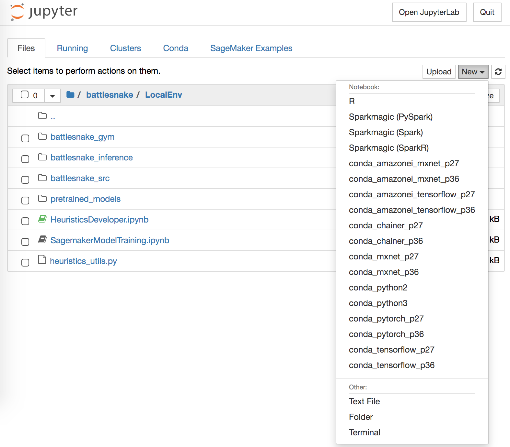
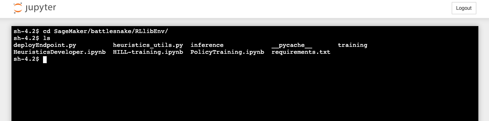

# Setup source control

This page explain how to initiate a git repository containing the change you made. Push your change on it and restore your work on a new stack.

## 1. Save your work in git

### 1.1. Create a repository

Using AWS Code commit or Github create an empty repository.
Take note of the cloning URL of the repository.

### 1.2. Open a terminal on the notebook instance

Using the outputs tab of the AWS CloudFormation stack, click on the link next to _SourceEditionInNotebook_.

Once the Jupyter notebook open, click new and openterminal like on the screenshot:



This should open an terminal like this: 



Once open type the following commands:

```
cd SageMaker/battlesnake/RLlibEnv
git init
git remote add origin <YOUR-GIT-URL>

# You should set your git author identity
git config --local user.email "<YOUR-EMAIL>"
git config --local user.name "<YOUR-NAME>"

# Add all the code and push it
git add -A
git commit -m "Initial commit"
git push --set-upstream origin master
```

Now your code is in configuration and you can use the terminal to sync and save your work.

## 2. Restore your code on another a recreated stack

If you have already a git repository with your work and you want to restore your work on another stack (on a freshly recreated stack or on a friend AWS account to collaborate) follow these steps.

Using the outputs tab of the AWS CloudFormation stack, click on the link next to _SourceEditionInNotebook_.

Once the Jupyter notebook open, click new and openterminal like on the screenshot:


This should open an terminal like this: 


Once open type the following commands:

```
cd SageMaker/battlesnake/
git clone <YOUR-GIT-URL>

# You should set your git author identity
git config --local user.email "<YOUR-EMAIL>"
git config --local user.name "<YOUR-NAME>"
```

From now you are good to go.

> __WARNING__: There is no guaranty that your code will work in future version of the __sagemaker-battlesnake-ai__ project. You may need to update your code a bit to make it working.
