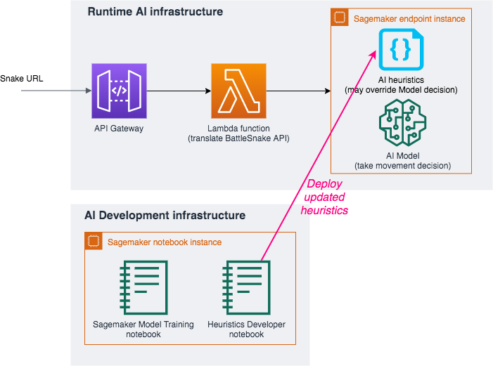

# STEP 2 - Customize the AI heuristics

This section explain how to write your own routines to override the AI's movement decisions (Heuristics).

The AI decision can from your customised model if you ran the [STEP 3](TrainModelAndDeploy.md) or the provided pretrained model from [STEP 1](DeployTheAIEndpoint.md).

> __PRE-REQUISITE__: In any case, you need to run __[STEP 1 - Deploy the environment](DeployTheAIEndpoint.md)__ before following this instructions.

For example, you can calculate if the move will make you collide into a snake body or head with a longer body (in both case you die).

Another one will be detect that you may be able to kill another shorter snake colliding head to head.

_If you do clever things, your pull request is welcome!_

## Architecture

> __Estimated cost__ : This environment does not add any cost to the [STEP 1 environment](DeployTheAIEndpoint.md). The free tiers include 250 hours per month of this notebook instance on the first two months.
> After the free tiers the charge will be $0.269 per hour for the notebook instance ($6.5 per 24 hour period).
> __Saving tip__ : Once you have finished working you can stop your notebook instance to stop consuming free tiers or occuring charge. You can restart them later to continue your work.

## How to develop your own heuristic algorithms

### Open and load the heuristic dev environment

From the Cloudformation stack created at [STEP 1](DeployTheAIEndpoint.md) go on outputs tab and click on the link next to _HeuristicsDevEnvironment_:

Now that you have the notebook `HeuristicDeveloper.ipynb` open and ensure that you have a functioning model (if you have altered the inputs model, you may need to configure the inference step in `heuristics_utils.get_action(*args)`). Press ► on the top to run the notebook (_see [here](https://www.youtube.com/watch?v=7wfPqAyYADY) for a tutorial on how to use jupyter notebooks_).

### Open the heuristic source code

From the Cloudformation stack created at [STEP 1](DeployTheAIEndpoint.md) go on outputs tab and click on the link next to _SourceEditionInNotebook_:

Then navigate to `battlesnake_inference/battlesnake_heuristics.py`

You can customize the `run` method in the class `MyBattlesnakeHeuristics` in  with your own rules (see the `go_to_food_if_close` for an example). 

> __Dev tools:__ Editing code in Jupyter with no source version control is convenient for test but won't work for big projects. If you want to go further follow the [setup source control](SetupSourceControl.md)

## Visualising your algorithm

- If you want to visualise the model, ensure that you are using *Jupyter* not *JupyterLab* (this is default if you use the links from AWS CloudFormation).
- The notebook loads a pre-trained model and simulate the actions.
- After the *Playback the simulation* section, you should see the step-by-step positions, actions, health etc. of each snake.
- If you want to specify the positions of each snake and food (instead of randomly generating it), you can enter it in `initial_state` in *Define the openAI gym*. initial_state is defined similarly to the [battlesnake API](https://docs.battlesnake.com/snake-api).

## Deploy your own custom snake

- If you trained a new model (but did not deploy it yet), run the cell in *(Optional) Run if you retrained the model*
- Otherwise, simply run the cell in *Deploy your new heuristics* and your snake will be deployed.
- Note that there's no need to change the url on the battlesnake engine.

## Next step: customize the Model

Go to __[STEP 3 - Train the AI model with your own settings](TrainModelAndDeploy.md)__ to train the model again with your own settings.
