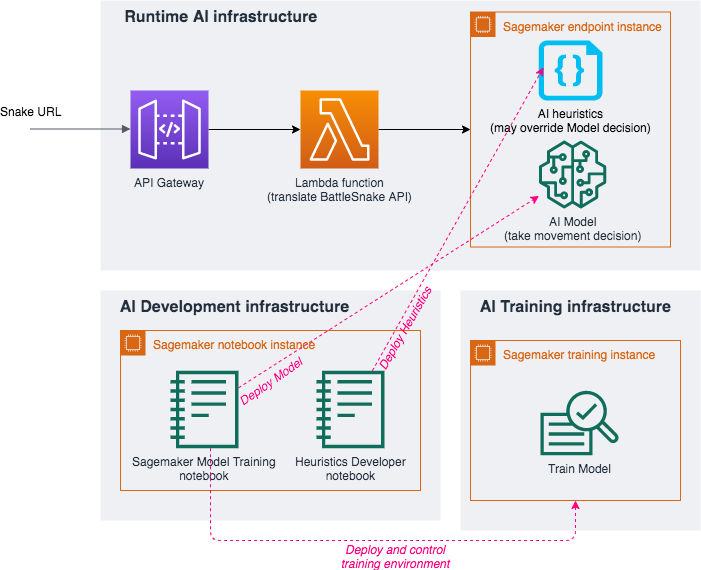
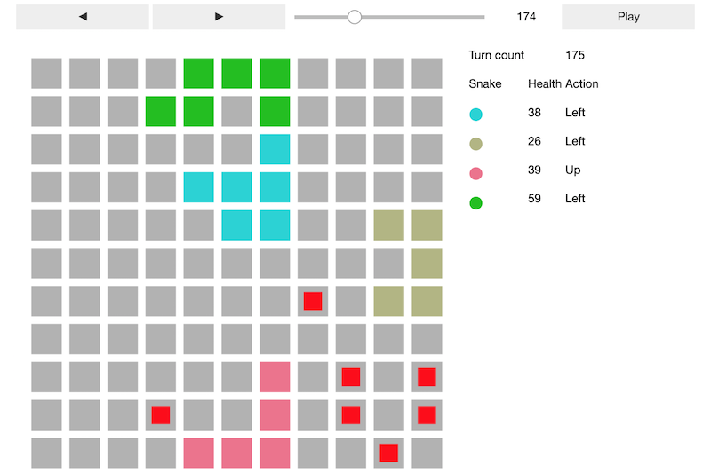

# Amazon SageMaker for Battlesnake AI

This project shows how to build and deploy an AI for the platform [Battlesnake](https://play.battlesnake.com/) on AWS with [Amazon Sagemaker](https://aws.amazon.com/sagemaker/)!

It is ready to deploy and contains learning materials for AI enthusiasts.

__What is Battlesnake?__ (taken from [battlesnake.com](https://docs.battlesnake.com/rules)):

> Battlesnake is an autonomous survival game where your snake competes with others to find and eat food without being eliminated. To accomplish this, you will have to teach your snake to navigate the serpentine paths created by walls, other snakes, and their own growing tail without running out of energy.

## Intention

This project contains a ready-to-use AI for Battlesnake as well as a development environment that can be used to modify and improve the AI.
The included AI makes movement decisions in two steps:
 1. __Run a Neural Network Model__ 
 2. __Run Heuristics__ (ie: additional code that can override the Neural Network's predicted best action so that your snake avoids colliding with walls, eats food if it is safe to do so, attempts to eat a competitor snake, ...)

Several pre-trained neural network models are provided within this project as well as some default heuristics. These pre-trained models (snakes) are not designed to win the Battlesnake competition, so you'll have to improve them in order to have a chance of winning. The training environment is provided for you to make modifications and to retrain the neural network models in order to obtain better results.

## Project Organisation

This project can be used in three steps:

- __[Step 1 - Deploy a Snake](Documentation/DeployTheAIEndpoint.md)__ : Deploy a snake with pre-trained AI. After this step, you'll be able to participate in a Battlesnake game! **Don't skip this step!** This step also deploys a local environment which is needed for the following steps.)
- __[Step 2 - Build some Heuristics](Documentation/UpdateHeuristicsAndDeploy.md)__ : Write some rules for your snake to navigate common scenarios, visualize your snake, and publish the upgraded version of your snake!
- __[Step 3 - Upgrade your Reinforcement Learning Model](Documentation/TrainModelAndDeploy.md)__ : This is the most rewarding step. Retrain your snake with different settings, visualize your snake, and publish an upgraded version!

### Architecture

If you use Steps 1-3, you will have the following deployed within your AWS account:



### Cost

This project has been designed to run within the AWS free tiers for some time.
Refer to each step above in order to understand the costs that may be incurred after the free tiers are exceeded.

### Content

The included Jupyter notebooks are bundled with a step-by-step Battlesnake visualizer:



With the Battlesnake visualizer, you can load any initial state and test how your snake will behave in various situations (See the [Visualize your algorithm](Documentation/UpdateHeuristicsAndDeploy.md#visualizing-your-algorithm) section for the full list of features.)

The source code of the project is organized as follows:

```
CloudFormation                    # contains the templates and scripts to automate deployment
InferenceEndpoint                 # contains the code for the Snake Endpoint
  > PretrainedModels              # existing models that are already trained
  > SnakeInference                # code that exposes the Snake API
  > SageMakerEndpoint             # code that is used for model inference with SageMaker
TrainingEnvironment
 > battlesnake_gym                # OpenAI Gym environment that simulates the Battlesnake game engine
 > notebook
   > HeuristicsDeveloper.ipynb    # Jupyter notebook for heuristics development
   > SagemakerModelTraining.ipynb # Jupyter notebook for model training    
```

## License

This project is licensed under the Apache-2.0 License.
